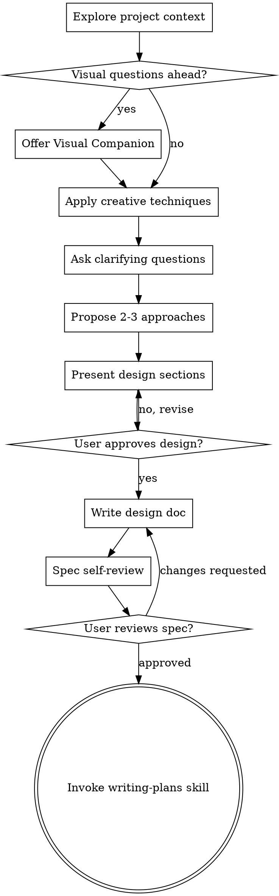

# Brainstorming Ideas Into Designs

Help turn ideas into fully formed designs and specs through natural collaborative dialogue using structured creativity techniques.

## Overview

This skill combines two powerful approaches:
1. **Structured Design Process** - Systematic exploration of requirements, approaches, and design
2. **Creative Ideation Methods** - Diverse brainstorming techniques to generate innovative solutions

Start by understanding the current project context, then use creative techniques to explore possibilities. Ask questions to refine the idea, present design options, and get user approval.

<HARD-GATE>
Do NOT invoke any implementation skill, write any code, scaffold any project, or take any implementation action until you have presented a design and the user has approved it. This applies to EVERY project regardless of perceived simplicity.
</HARD-GATE>

## Anti-Pattern: "This Is Too Simple To Need A Design"

Every project goes through this process. A todo list, a single-function utility, a config change — all of them. "Simple" projects are where unexamined assumptions cause the most wasted work. The design can be short (a few sentences for truly simple projects), but you MUST present it and get approval.

## Workflow Architecture

This uses **step-file architecture** for disciplined execution:

- Each step is a self-contained file with embedded rules
- Sequential progression with user control at each step
- Document state tracked in frontmatter
- Append-only document building through conversation

## Checklist

You MUST create a task for each of these items and complete them in order:

1. **Explore project context** — check files, docs, recent commits
2. **Offer visual companion** (if topic will involve visual questions) — this is its own message, not combined with a clarifying question
3. **Apply creative techniques** — use structured brainstorming methods to generate diverse ideas
4. **Ask clarifying questions** — one at a time, understand purpose/constraints/success criteria
5. **Propose 2-3 approaches** — with trade-offs and your recommendation
6. **Present design** — in sections scaled to their complexity, get user approval after each section
7. **Write design doc** — save to `docs/designs/YYYY-MM-DD-<topic>-design.md` and commit
8. **Spec self-review** — quick inline check for placeholders, contradictions, ambiguity, scope
9. **User reviews written spec** — ask user to review the spec file before proceeding
10. **Transition to implementation** — invoke writing-plans skill to create implementation plan

## Process Flow

**The terminal state is invoking writing-plans.** Do NOT invoke any other implementation skill. The ONLY skill you invoke after brainstorming is writing-plans.

## Execution

Read fully and follow: `./workflow.md` to begin the brainstorming session.

## Key Principles

- **One question at a time** - Don't overwhelm with multiple questions
- **Multiple choice preferred** - Easier to answer than open-ended when possible
- **Quantity over quality initially** - Generate many ideas before organizing
- **YAGNI ruthlessly** - Remove unnecessary features from all designs
- **Explore alternatives** - Always propose 2-3 approaches before settling
- **Incremental validation** - Present design, get approval before moving on
- **Be flexible** - Go back and clarify when something doesn't make sense
- **Creative diversity** - Use different brainstorming techniques to avoid semantic clustering

## Critical Mindset

Your job is to keep the user in generative exploration mode as long as possible. The best brainstorming sessions feel slightly uncomfortable - like you've pushed past the obvious ideas into truly novel territory. Resist the urge to organize or conclude too early. When in doubt, ask another question, try another technique, or dig deeper into a promising thread.

## Visual Companion

A browser-based companion for showing mockups, diagrams, and visual options during brainstorming. Available as a tool — not a mode. Accepting the companion means it's available for questions that benefit from visual treatment; it does NOT mean every question goes through the browser.

**Offering the companion:** When you anticipate that upcoming questions will involve visual content (mockups, layouts, diagrams), offer it once for consent:
> "Some of what we're working on might be easier to explain if I can show it to you in a web browser. I can put together mockups, diagrams, comparisons, and other visuals as we go. Want to try it?"

**This offer MUST be its own message.** Do not combine it with clarifying questions, context summaries, or any other content. Wait for the user's response before continuing. If they decline, proceed with text-only brainstorming.

**Per-question decision:** Even after the user accepts, decide FOR EACH QUESTION whether to use the browser or the terminal. The test: **would the user understand this better by seeing it than reading it?**

- **Use the browser** for content that IS visual — mockups, wireframes, layout comparisons, architecture diagrams
- **Use the terminal** for content that is text — requirements questions, conceptual choices, tradeoff lists

A question about a UI topic is not automatically a visual question. "What does personality mean in this context?" is a conceptual question — use the terminal. "Which wizard layout works better?" is a visual question — use the browser.
